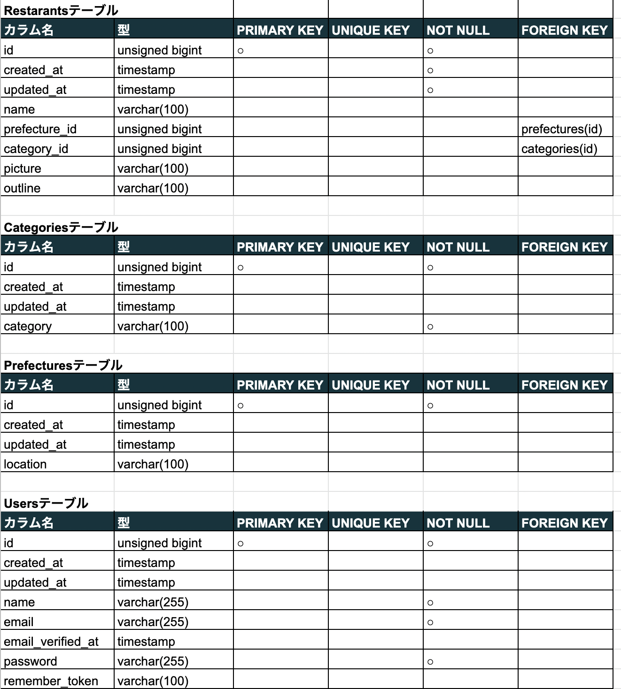
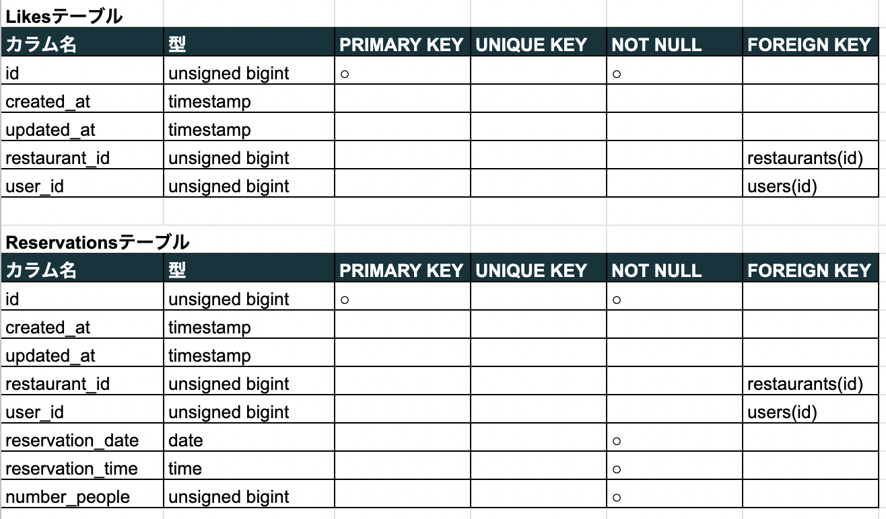
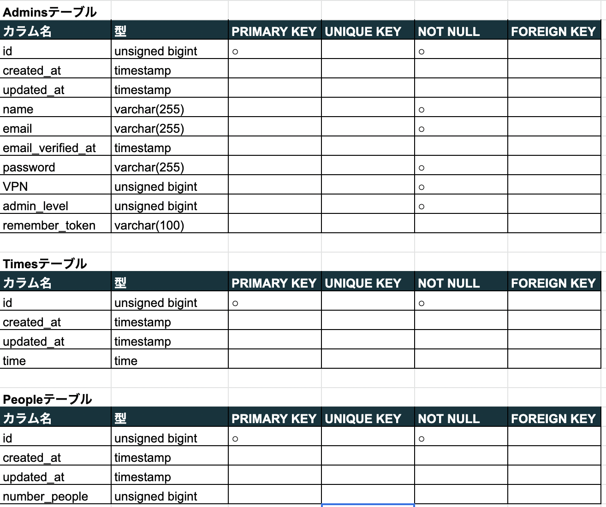
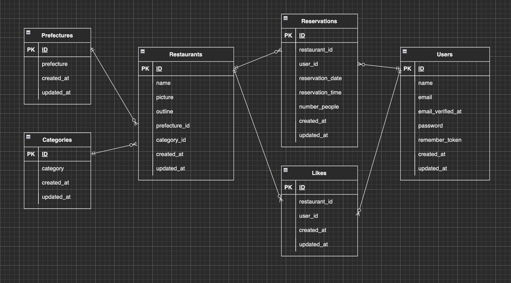

## アプリケーション名

Rese 飲食店予約サービスに使用するアプリ

## 作成した目的

外部の飲食店予約サービスは手数料を取られるので自社で予約サービスを持ちたい。

## アプリケーションURL

なし

## 他のリポジトリ

なし

## 機能一覧

<li>会員登録機能</li>
<li>ログイン機能</li>
<li>店一覧取得機能</li>
<li>店検索機能</li>
<li>予約機能</li>
<li>予約変更機能</li>
<li>お気に入り機能</li>
<li>評価機能</li>
<li>バリデーション</li>
<li>管理者用の認証機能</li>
<li>管理画面から飲食店の追加</li>
<li>ログインユーザーの権限によるミドルウェア</li>

## 使用技術(実行環境)

Laravel 8

## テーブル設計

## ER図<

## その他特記事項

顧客ユーザー 
ID:guest@example.com 
PW:password
  

"/admin/login"から管理者用のログインページ

管理者 
ID:owner@example.com 
PW:password
  
仙人マネジャー 
ID:@example.com 
PW:password

